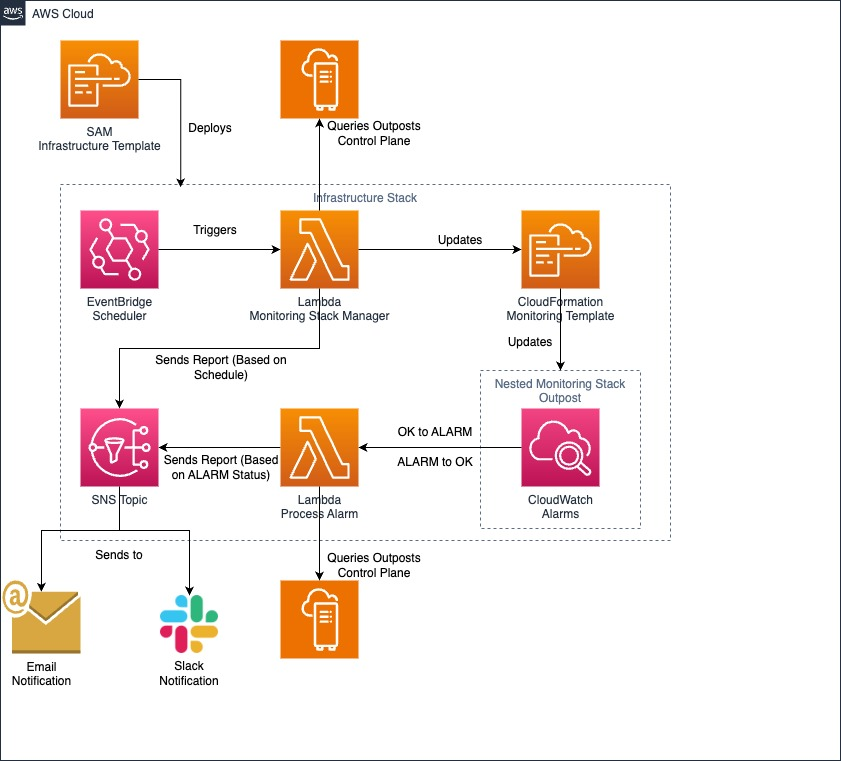

# AWS Outposts N+M Resiliency Monitoring Solution

This solution helps customers monitor and maintain N+M resiliency on AWS Outposts Racks by automatically detecting and alerting on capacity risks associated with single or multiple host failures. It enables proactive capacity management by identifying scenarios where running workloads cannot be redistributed to healthy hosts during host failures, whether due to issues, unplanned downtime, or scheduled maintenance.

## Architecture Diagram



## Solution Overview

The solution monitors AWS Outposts Racks capacity and provides notifications when the N+M resiliency level is at risk. It consists of:

1. A monitoring framework that continuously evaluates the Outpost's capacity
2. Automated alerts when resiliency risks are detected
3. Detailed analysis reports to help understand and mitigate risks
4. Scheduled evaluations to ensure monitoring remains consistent with current slotting configurations

## Configuration Parameters

Before deploying the solution, gather the following information:

- **OutpostIds** (Required)
  - List of Outpost IDs to monitor
  - Format: `op-xxxxxxxxxxxxxxxx` (each ID starts with 'op-' followed by 17 hexadecimal characters)
  - Example: `op-1234567890abcdef1`
  - For multiple Outposts, separate IDs with commas (no spaces): `op-1234567890abcdef1,op-abcdef1234567890a`

- **M** (Optional)
  - Number of hosts that can fail while maintaining workload capacity
  - Range: 0-10
  - Default: 1
  - Leave empty to use default value

- **ScheduleCron** (Optional)
  - Schedule for running monitoring checks
  - Default: `cron(0 0 * * ? *)` (daily at midnight)
  - Common alternatives:
    - `rate(1 day)` - Every day
    - `rate(12 hours)` - Every 12 hours
  - Leave empty to use default value

- **EmailAddresses** (Required)
  - Email addresses that will receive notifications
  - Format: `user@domain.com`
  - For multiple addresses, separate with commas (no spaces): `user1@domain.com,user2@domain.com`

- **InstanceFamilyResiliencyMap** (Optional)
  - JSON map to set different M values per instance family
  - Default: `{}`
  - Example to set no protection (M=0) for g4dn and i3en families: `{"g4dn":0,"i3en":0}`
  - Leave empty to use the default M value for all instance families

## Prerequisites

- AWS CLI installed and configured
- AWS SAM CLI installed
- One or more AWS Outposts Racks in your account
- Permissions to create IAM roles, Lambda functions, CloudWatch alarms, and EventBridge rules

## Installation

### Quick Start

1. Open AWS CloudShell in the region where your Outpost resides

  *Note: while CloudShell is recommended, you may use any environment of your choice as long as the prerequisites are satisfied*

2. Clone the repository:
   ```bash
   git clone https://github.com/aws-samples/sample-outposts-nm-resiliency
   cd sample-outposts-nm-resiliency
   ```

3. Deploy the solution:
   ```bash
   ./bootstrap.sh
   ```

### Deployment Example

Here's an example of the deployment process with explanations:

```
AWS Outposts N+M Resiliency Monitoring - Bootstrap Script
-----------------------------------------------------
Recommendation: Run this script in AWS CloudShell for the best experience.

No existing configuration found. Running guided deployment...

Configuring SAM deploy
======================

        Looking for config file [samconfig.toml] :  Not found

        Setting default arguments for 'sam deploy'
        =========================================
        Stack Name [sam-app]: outposts-nm-resiliency        # Enter stack name or accept default
        AWS Region [us-east-1]: us-west-2                   # Enter your region
        Parameter OutpostIds []: op-1234567890abcdef1       # Enter your Outpost ID
        Parameter M [1]:                                     # Press Enter to accept default (1)
        Parameter ScheduleCron [cron(0 0 * * ? *)]:         # Press Enter to accept default
        Parameter EmailAddresses []: user@domain.com         # Enter your email
        Parameter InstanceFamilyResiliencyMap [{}]: {"g4dn":0,"i3en":0}  # Optional: Enter JSON map or press Enter
        Confirm changes before deploy [y/N]:                 # Recommended: Enter 'y'
        Allow SAM CLI IAM role creation [Y/n]:              # Recommended: Press Enter
        Disable rollback [y/N]:                             # Recommended: Press Enter (No)
        Save arguments to configuration file [Y/n]:          # Recommended: Press Enter
        SAM configuration file [samconfig.toml]:            # Press Enter
        SAM configuration environment [default]:             # Press Enter
```

### Configuration Updates

To modify the configuration:
```bash
./bootstrap.sh configure
```

### Cleanup

To remove all resources:
```bash
./bootstrap.sh cleanup
```

## Operation

The solution operates through two main components:

1. **Monitoring Stack Manager**
   - Creates and updates CloudWatch alarms based on current configuration
   - Runs on the configured schedule
   - Sends status reports via email

2. **Process Alarm**
   - Analyzes capacity risks when alarms trigger
   - Provides detailed analysis of impact
   - Suggests potential mitigation strategies

## Notifications

You will receive email notifications for:
- Scheduled status reports
- Resiliency risk alerts identified by the Alarms configured by the Monitoring Stack Manager

## SNS-Slack integration

To configure an Amazon SNS topic to output messages to Slack, you have two options. You can either integrate with Slack’s email-to-channel integration, which allows Slack to accept email messages and forward them to a Slack channel, or you can use a Lambda function to rewrite the Amazon SNS notification to Slack. For more information about forwarding emails to slack channels, see [Confirming AWS SNS Topic Subscription for Slack Webhook](https://stackoverflow.com/questions/49341187/confirming-aws-sns-topic-subscription-for-slack-webhook). For more information about constructing a Lambda function to convert Amazon SNS messages to Slack, see [How do I use webhooks to publish Amazon SNS messages to Amazon Chime, Slack, or Microsoft Teams?](https://repost.aws/knowledge-center/sns-lambda-webhooks-chime-slack-teams).

## Support

For issues, questions, or contributions, please open a GitHub issue at:
https://github.com/aws-samples/outposts-nm-resiliency/issues

## License

This project is licensed under the MIT-0 License. See the LICENSE file for details.
